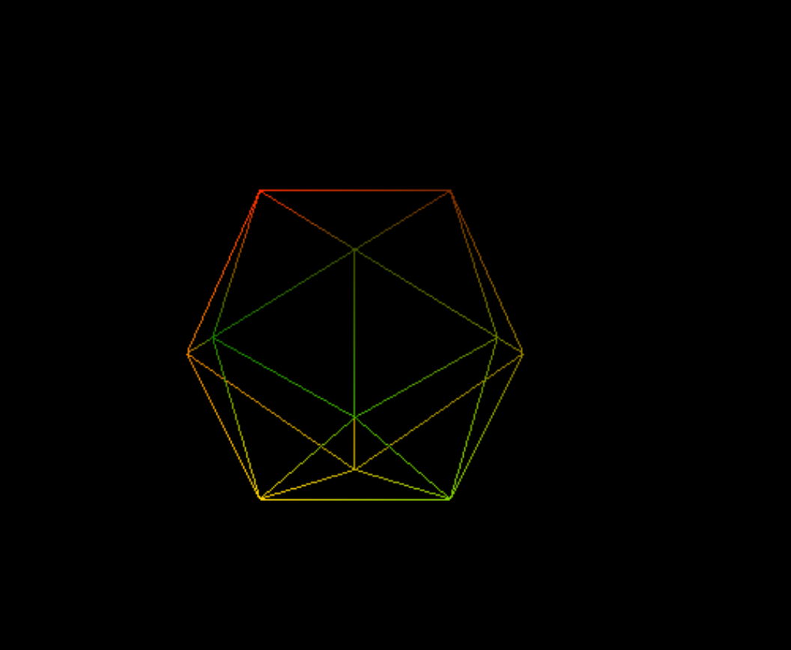

Minimalistic WebGPU rendering project with vanilla JS and Webassembly.
Based on Tsoding's Rust Browser Game

# install webgpu types to have autocomplete and documentation available
npm install --save @webgpu/types

# wireframe rendering:

